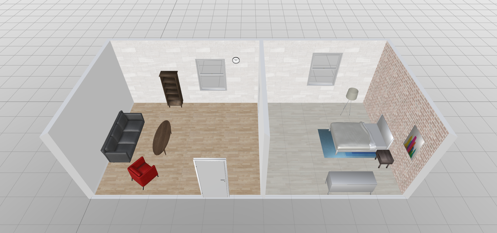
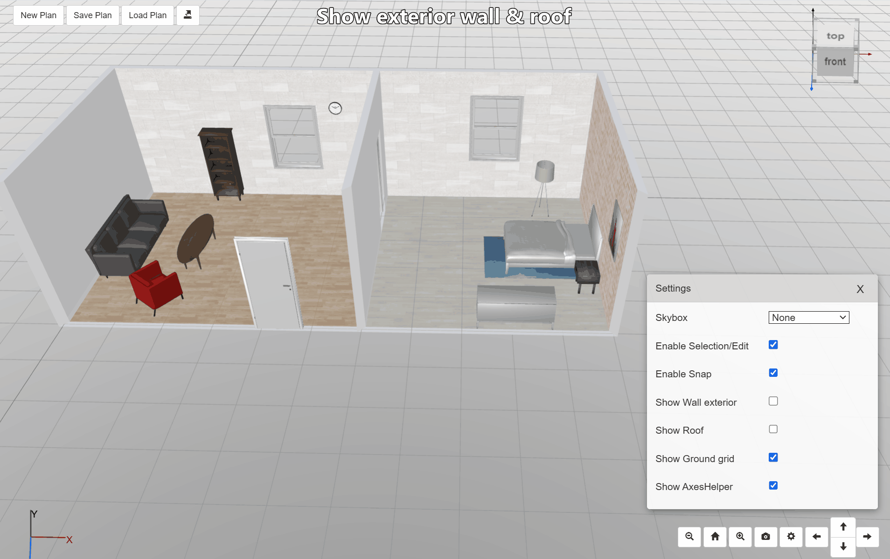

# bp3d-examples
An example project for bp3d.

## What is bp3d?
bp3d is a js library built on three.js that allows users to design an interior space such as a home, apartment or shop. Its code references the [blueprint3d](https://github.com/furnishup/blueprint3d) implementation.



Many thanks to three.js, blueprint3d, npm, etc.

## Features
- Edit in 2d floorplan to create walls/rooms
- Edit in 3d model design to add entities. E.g., s/he can add doors, windows, furnitures, etc.
- Edit entity with gizmo and snap
- Toggle wall exterior and roof visibility


## Plugins
It is easy to build your own plugins based on @bp3d/core.

These are some plugins in @bp3d/plugins:
- AxisGizmoPlugin
- GroundGridPlugin
- SkyboxPlugin
- ToolbarPlugin
- ViewCubePlugin

## Examples
```
import { Viewer2d, Viewer3d } from "@bp3d/core";
import { SkyboxPlugin } from "@bp3d/plugins";

const viewer3d = new Viewer3d({ containerId: "viewer3d" });
new SkyboxPlugin(viewer3d);

const myPlan = "http://www.abc.com/myplan.bp3d";
viewer3d.loadPlan(myPlan);
viewer3d.goToHomeView();
```
